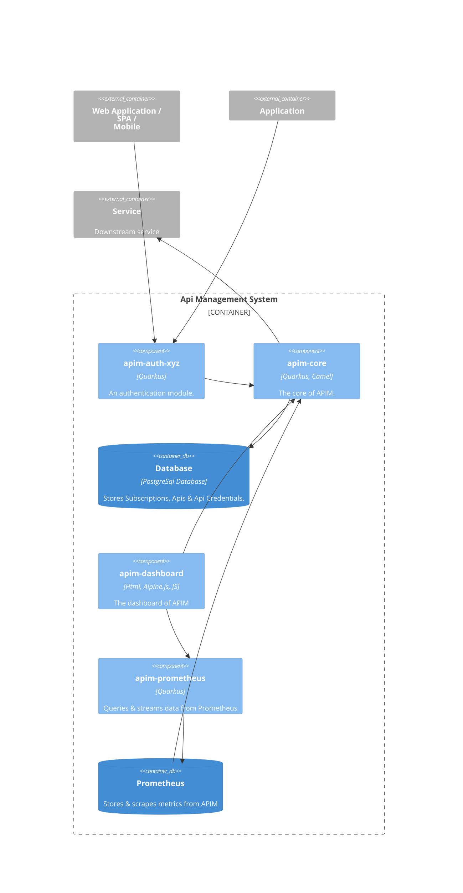
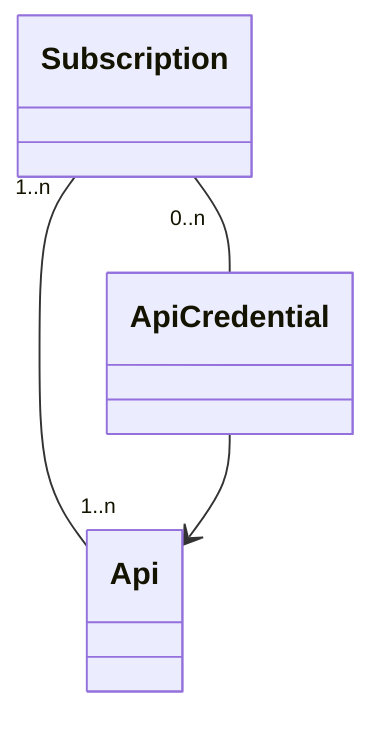

# Background

This project contains an api-management (APIM) system built with Quarkus and Apache Camel. It is built in a modular way,
where you can build your own APIM in a customizable way that fits your needs. Almost all functionalities are optional
beside the core.

Note that this project is still in progress.

## Features

The APIM provides the following features:

- proxying REST, SOAP & GraphQL protocols,
- managing APIs & Subscriptions via a Dashboard,
- versioning & routing: easily manage multiple versions of your APIs and route traffic to the appropriate version.
- analytics: tracing, metrics & logging info about an API,
- white- & blacklisting, 
- rate limiting,
- circuit breaker,
- multipart & file upload support,
- CORS,
- TLS/SSL,
- Basic Auth, Client Credentials, token based or pass-through authentication for the APIs,
- OAuth/OIDC, custom JWT, properties file based, Database and LDAP authentication for the APIM,

Non-functional features:
- Scalability: the APIM is designed to be highly scalable, with the ability to handle high-traffic API workloads. 
It can be deployed in a distributed, clustered environment for improved availability and performance.
- Flexibility: APIM can be easily extended by making use of hooks or template Routes to add new functionalities. Like connecting to other 
backends or middleware: Messaging Queues/Topics, Databases, Fileservers, SaaS, etc.
- Security: APIM provides built-in security features, such as authentication (e.g., OAuth 2.0, JWT), rate limiting, and IP whitelisting/blacklisting, to protect your APIs.
- Monitoring and Observability: APIM offers extensive monitoring and observability features, including metrics, logging, and tracing, to help you understand the performance and health of your API ecosystem.
- Deployment Flexibility: APIM can be deployed in a variety of environments, including on-premises, in the cloud, or in a hybrid setup, and can be integrated with popular orchestration platforms like Kubernetes and Docker.

TODOS:

- add Readme to each module
- documentation on how to use in production

## Modules

The project consists of the following modules:

| Name                        | Description                                                                                                                                                       | 
|-----------------------------|-------------------------------------------------------------------------------------------------------------------------------------------------------------------|
| `apim-application`          | This is the main application which contains all the necessary modules to build the APIM                                                                           |
| `apim-auth-file-properties` | This module contains a properties file based (basic) authentication. Not intended to be used in production                                                        |
| `apim-auth-oidc`            | This module contains OIDC & OAuth 2.0 authentication. Should not be combined with any other authentication modules !                                              | 
| `apim-auth-jpa`             | This module contains (basic) authentication based upon users & roles stored in a database.                                                                        | 
| `apim-auth-ldap`            | This module contains (basic) authentication based upon LDAP authentication.                                                                                       |
| `apim-auth-jwt`             | This module adds JWT token generation and it enables Bearer authentication.  And it must be used in combination with one of the other authentication modules. |
| `apim-core`                 | This module is the core of the APIM, containing the logic for reverse proxying and managing Subscriptions and Apis.                                               |
| `apim-prometheus-client`    | This module exposes a REST SSE endpoint for streaming Prometheus metrics. Intended usage is for web-applications for showing metrics on dashboards.               |
| `apim-commons`              | This module is a shared library used within other modules.                                                                                                        |
| `apim-dashboard-alpinejs`   | This module contains the dashboard (frontend) for the APIM.                                                                                                       |

These modules should be included in the `pom.xml` of `apim-application`. And one of the `apim-auth-xyz` modules must
also be included for adding authentication.

For more info on how to use these modules, refer to the `README.md` file in each module.

## Architecture

## Requisites

To build and run this project locally, you need the following libraries and tools:

- Java 21 or greater
- Maven 3.9.x or greater
- Docker or Podman
- A REST client tool like Postman, httpie, Curl, etc. In the examples below, httpie is used.

## Terminology

- _Subscription_: this is similar to a team or an organisation who wants to subscribe and gain access to the APIM.
  A Subscription can have many Apis. After subscribing successfully, a subscription key will be generated. This is
  needed to gain access to the APIM.
- _Api_: this is the Api of the downstream service/backend that needs to be accessed via the APIM. An Api can be shared
  among many Subscriptions.
- _ApiCredentials_: optional: you can add an authentication method to an Api, if this is needed. An ApiCredential
  belongs to a Subscription.    
  The supported authentication methods are:
    - basic auth
    - client credentials
    - token based
    - pass-through, this is the default behaviour, and it will pass through anything from the original request to the
      downstream services.

## Usage in development mode

First build the whole project:

> mvn clean install -DskipTests

Then go to `apim-application` folder:
> cd apim-application

and edit `pom.xml` and choose the modules you want to use.

Note: in the examples below, `apim-auth-jwt` and `apim-auth-file-properties` are used.

Start the app in development mode:
> mvn quarkus:dev

### Using the dashboard

If `apim-dashboard-alpinejs` is included in `apim-application`, then you can open the application via:

> http://localhost:8080/pages/index.html

The default user with the `manager` and `viewer` roles is:
- username: bob
- password: bob

#### Adding APIs
On the Dashboard click: `APIs > New API` to add an API. 

- __Proxy Path__: is the mapping prefix to the API. 
- __Proxy Url__: is the URL of the API.
- __Owner__: the team or organisation that owns the API.
- __Authentication Type__: default is passthrough (even when you leave it empty). Choose this if the API requires authentication.

When you have added the API, you will see this:

The full url to call https://jsonplaceholder.typicode.com from the APIM will be: 

http://localhost:8080/gateway/v1/jp (See also the `Info` icon the table row)

- `/gateway`: this is the `apim.context-root` see also `application.propeties` in `apim-application` folder. All Api
  calls will start with this path.
- `/v1/jp`: is the mapping (the `proxyPath`). Any call to `/v1/jp` will be forwarded to `https://jsonplaceholder.typicode.com` (the proxyUrl).
- any path after `/v1/jp` will be added and forwarded to `proxyUrl`. This includes: query parameters, headers, cookies
  and the request body.

#### Adding a Subscription

On the Dashboard click: `Subsriptions > New Subscription` to add a subscription.

- __Name__: the name for the subscription, usually the name of a team or organisation.
- __User accounts__: a comma separated list of accounts, that belong to this subscription. This is needed when a team member wants to view his subscription
via the dashboard. Max. 20 accounts allowed.
- __End date__: a date in the future to end the subscription (not mandatory), if the subscription is temporary.

#### Adding APIs to a Subscription

On the Dashboard click: `Subscriptions > Select a subscription from the table > choose the APIs tab > Add API`.

#### Adding a Credential to an API (if needed)

Make sure that the API has an `Authentication Type`:

On the Dashboard click: `Subscriptions > Select a subscription from the table > choose the APIs tab > Click + button on the row`.

The `+` button will only show up, if the API has an `Authentication Type` which is not equal to `passthrough`.

#### View My Subscription

If the logged-in user has a subscription, and the latter contains his username in `User Accounts` (see above), then the user can view his subscription via:
`My Subscription`.

#### View Analytics

Analytics only works if `apim-prometheus-client` is added to `apim-application`, and with a running Prometheus instance. See also [README.md of apim-prometheus](apim-prometheus-client/README.md).

Analytics are shown, when the APIM has processed requests (see below), and it shows the following:

- Total amount of all requests
- Avg. response time of all requests
- Top 10 API requests
- Top 10 API avg. response times
- Top 10 API requests per subscription
- Top 10 API requests and its status

#### White & Blacklisting IP Addresses

You can control which IP addresses can have access to the APIM by adding new entries to the `Access Control` table: 

- __IP Address__: this can be a ipv4 or ipv6 address with or without a CIDR. In the example above, all requests from 127.x.x.x will be blocked: 

#### Cleaning up expired subscriptions

In the example below, there are some expired subscriptions: 

To clean these up manually, follow the instructions below:

## Making requests via the APIM

Depending on which authentication module has been chosen, you need to authenticate yourself first, and you also need to have a subscription key.

- First obtain a JWT token for accessing the gateway:

> http -a bob:bob post :8080/apim/auth/token  
> { "access_token": "ej....." }

Save the access token as a variable:
> JWT_TOKEN=ej...

- Now call your API via the gateway.

> http -A bearer -a $JWT_TOKEN post :8080/gateway/v1/jp subscription-key:[your key]

## Important urls

You can access the following urls when the application runs in development mode:

- [APIM Dashboard](http://localhost:8080/pages/index.html)
- [Swagger UI](http://localhost:8080/q/swagger-ui)
- [Quarkus Development Dashboard](http://localhost:8080/q/dev-ui)
