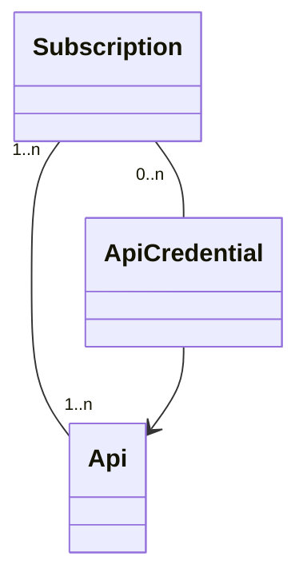
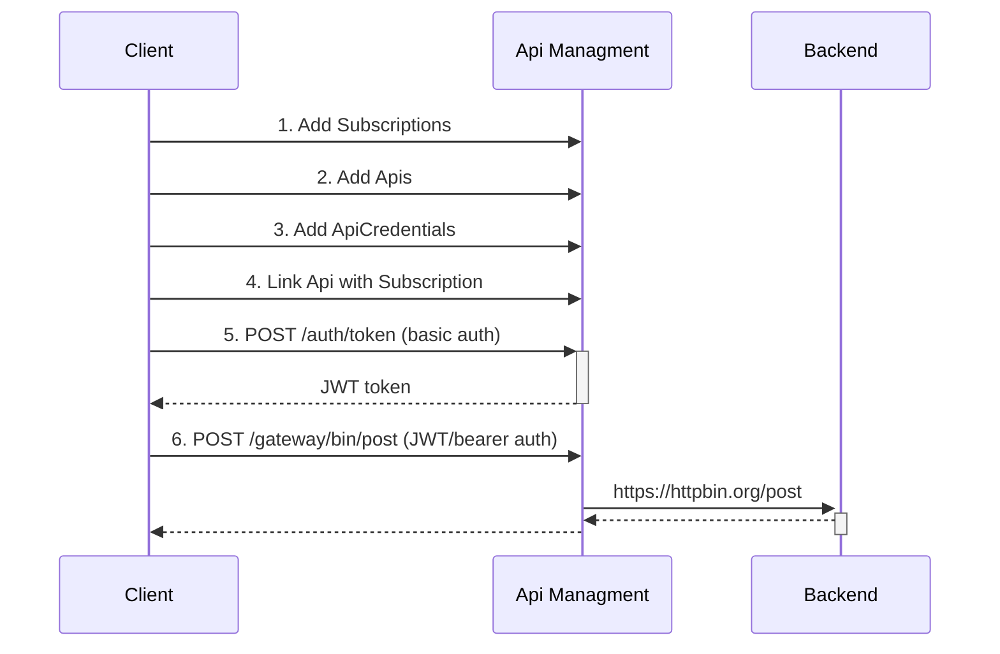

# Background

This project contains an api-management (APIM) system built with Quarkus and Apache Camel and has the following
functionalities:

- support for proxying REST & GraphQL,
- support for managing Apis & Subscriptions,
- support for metrics (showing per subscription the API calls's duration and amount),
- support for rate limiting,
- support for downstream Basic Auth, Client Credentials and token based authentication,
- support for OAuth/OIDC, custom JWT, properties file based, Database and LDAP authentication for the APIM

## Terminology

- _Subscription_: this is similar to a team or an organisation who wants to subscribe and gain access to the
  api-management system. A Subscription can have many Apis.
  After subscribing successfully, a subscription key will be generated. And this is needed to gain access to the apis.
- _Api_: this is the Api of the downstream service/backend that needs to be accessed via the APIM. An Api can be shared
  among many Subscriptions.
- _ApiCredentials_: optional: you can add an authentication method to the Api, if this is needed. An ApiCredential
  belongs to a Subscription and
  it should not be shared with other Subscriptions, although this is not prohibited.    
  The supported authentication methods are:
  - basic auth
  - client credentials
  - token based
  - passthrough, this is default behaviour and it will passthrough anything from the original request to the Api/Backend
    services, except the Authorization header.

### Example flow

# Usage

Start the app in development mode:
> mvn quarkus:dev

Create a subscription first:
> http -a bob:bob post :8080/subscriptions subject="My Organisation"  
> Connection: close  
> Content-Length: 0  
> Location: http://localhost:8080/subscriptions/N89GERY08JL91R022M5KOBF924XYRPKW

Add an Api:
> http -a bob:bob post :8080/apis proxyPath=/bin proxyUrl=https://httpbin.org owner="Team One" authenticationType=BASIC
> description="httpbin"

Protect the Api with Basic Auth and link it to the subscription:
> http -a bob:bob post :8080/apis/1/credentials subscriptionKey=N89GERY08JL91R022M5KOBF924XYRPKW username=admin
> password=12345

Link Api (with id=1) to the subscription (you can link many apis in an array):
> echo "[1]" | http -a bob:bob post :8080/subscriptions/N89GERY08JL91R022M5KOBF924XYRPKW/apis

Then obtain a JWT token for accessing the gateway:
> http -a bob:bob post :8080/auth/token  
> { "access_token": "ej....." }

Save the access token as a variable:
> JWT_TOKEN=ej...

Now call httpbin via the gateway. This will forward your requests to httpbin with Basic Auth:
> http -A bearer -a $JWT_TOKEN post :8080/gateway/bin/post subscription-key:N89GERY08JL91R022M5KOBF924XYRPKW

## Important urls

Start the application from `apim-application` with:
> mvn clean compile quarkus:dev

Then you can access the following urls:

- [Swagger UI](http://localhost:8080/q/swagger-ui)
- [Quarkus Development Dashboard](http://localhost:8080/q/dev-ui)