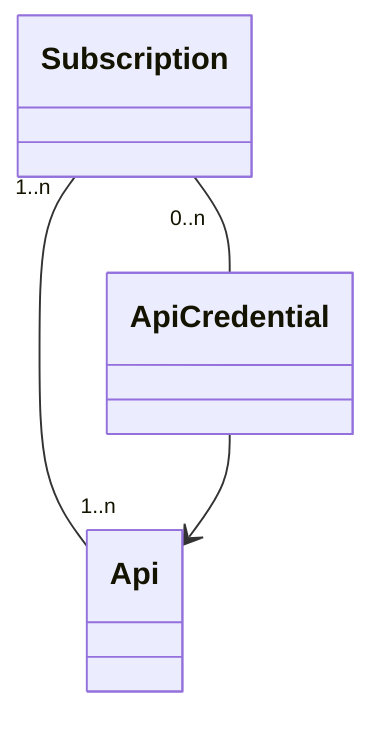
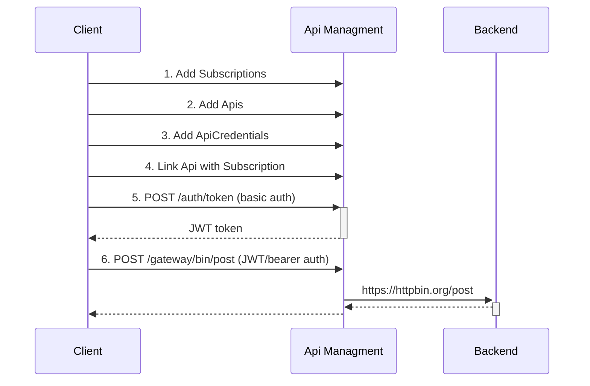

# Background

This project contains an api-management (APIM) system built with Quarkus and Apache Camel. It is built in a modular way,
where you can build your own APIM in a customizable way that fits your needs. Almost all functionalities are optional beside
the core.

## Features

The APIM provides the following features:

- support for proxying REST & GraphQL protocols,
- support for managing Apis & Subscriptions,
- support for metrics (showing per subscription the API calls's duration and amount),
- support for rate limiting,
- support for multipart,
- support for CORS,
- support for TLS/SSL,
- support for downstream Basic Auth, Client Credentials and token based authentication,
- support for OAuth/OIDC, custom JWT, properties file based, Database and LDAP authentication for the APIM.

TODOS:
 - a dashboard for managing the APIM
 - proxying websockets
 - documentation on how to use in production

## Modules

The project consists of the following modules:

| Name                        | Description                                                                                                                                                       | 
|-----------------------------|-------------------------------------------------------------------------------------------------------------------------------------------------------------------|
| `apim-application`          | This is the main application which contains all the necessary modules to build the APIM                                                                           |
| `apim-auth-file-properties` | This module contains a properties file based (basic) authentication. Not intended to be used in production                                                        |
| `apim-auth-oidc`            | This module contains OIDC & OAuth 2.0 authentication. Should not be combined with any other authentication modules !                                              | 
| `apim-auth-jpa`             | This module contains (basic) authentication based upon users & roles stored in a database.                                                                        | 
| `apim-auth-ldap`            | This module contains (basic) authentication based upon LDAP authentication.                                                                                       |
| `apim-auth-jwt`             | This module adds JWT token generation and it enables Bearer authentication.  And it must be used in combination with one of the other authentication modules. |
| `apim-core`                 | This module is the core of the APIM, containing the logic for reverse proxying and managing Subscriptions and Apis.                                               |
| `apim-prometheus-client`    | This module exposes a REST SSE endpoint for streaming Prometheus metrics. Intended usage is for web-applications for showing metrics on dashboards.               |
| `apim-commons`              | This module is a shared library used within other modules.                                                                                                        |

These modules should be included in the `pom.xml` of `apim-application`. And one of the `apim-auth-xyz` modules must also be included for adding authentication.

For more info on how to use these modules, refer to the `README.md` file in each module.

## Requisites

To build and run this project locally, you need the following libraries and tools:

- Java 21 or greater
- Maven 3.9.x or greater
- Docker or Podman
- A REST client library like Postman, Httpie, Curl, etc. In the examples below, I've used Httpie. 

## Terminology

- _Subscription_: this is similar to a team or an organisation who wants to subscribe and gain access to the
  api-management system. A Subscription can have many Apis.
  After subscribing successfully, a subscription key will be generated. This is needed to gain access to the APIM.
- _Api_: this is the Api of the downstream service/backend that needs to be accessed via the APIM. An Api can be shared
  among many Subscriptions.
- _ApiCredentials_: optional: you can add an authentication method to the Api, if this is needed. An ApiCredential
  belongs to a Subscription and
  it should not be shared with other Subscriptions, although this is not prohibited.    
  The supported authentication methods are:
    - basic auth
    - client credentials
    - token based
    - pass-through, this is default behaviour and it will passthrough anything from the original request to the
      Api/Backend
      services, except the Authorization header.

### An example flow

#### Usage in development mode

First go to `apim-application` folder and edit `pom.xml` and choose the modules you want to use:
> cd apim-application

Note: in the examples below, I've used `apim-auth-jwt` together with `apim-auth-file-properties`.

Start the app in development mode:
> mvn clean quarkus:dev

1. Create a subscription first:
> http -a bob:bob post :8080/subscriptions subject="My Organisation"  
> Connection: close  
> Content-Length: 0  
> Location: http://localhost:8080/subscriptions/N89GERY08JL91R022M5KOBF924XYRPKW

The response contain the subscription key (in the location header). This is later needed to access the APIM.

2. Add an Api to https://httpbin.org (it's a free site for testing REST endpoints):
> http -a bob:bob post :8080/apis proxyPath=/bin proxyUrl=https://httpbin.org owner="Team One" authenticationType=BASIC
> description="a proxy to httpbin"
 
The `proxyPath` is the mapping to httpbin.org. So to call this Api from the APIM, it will be like this:

http://localhost:8080/gateway/bin/any/path/to/httpbin

- `/gateway`: this is the `apim.context-root` see also `application.propeties` in `apim-application` folder. All Api calls will start with this path.
- `/bin`: is the mapping (the `proxyPath`) we defined for the Api. Any call to `/bin` will be forwarded to `httpbin.org` (the proxyUrl).
- any path after `/bin` will be added and forwarded to `httpbin.org`. This includes: query parameters, headers, cookies and the request body.

Furthermore, we specified that we want to protect this Api with Basic authentication, therefore we also need to add an `ApiCredential`.

3. Create an ApiCredential with Basic Auth and link it to the subscription:
> http -a bob:bob post :8080/apis/1/credentials subscriptionKey=N89GERY08JL91R022M5KOBF924XYRPKW username=admin password=12345

This will add an ApiCredential to Api with id=1 and to the subscription with the given key.

4. Link Api (with id=1) to the subscription (you can link many Apis in an array):
> echo "[1]" | http -a bob:bob post :8080/subscriptions/N89GERY08JL91R022M5KOBF924XYRPKW/apis

5. Then obtain a JWT token for accessing the gateway:
> http -a bob:bob post :8080/auth/token  
> { "access_token": "ej....." }

Save the access token as a variable:
> JWT_TOKEN=ej...

6. Now call httpbin via the gateway. This will forward your requests to httpbin with Basic Auth:
> http -A bearer -a $JWT_TOKEN post :8080/gateway/bin/post subscription-key:N89GERY08JL91R022M5KOBF924XYRPKW

## Important urls

You can access the following urls when the application runs in development mode:

- [Swagger UI](http://localhost:8080/q/swagger-ui)
- [Quarkus Development Dashboard](http://localhost:8080/q/dev-ui)