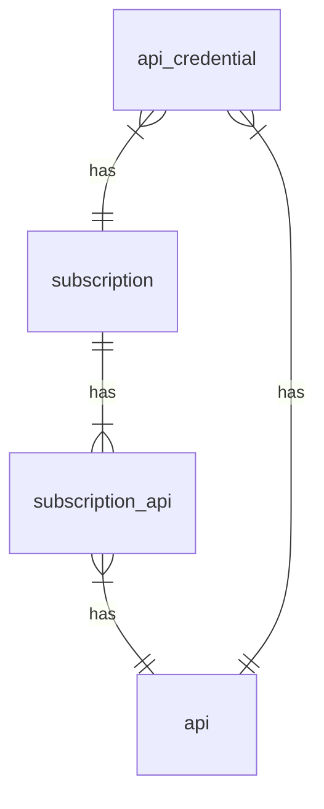
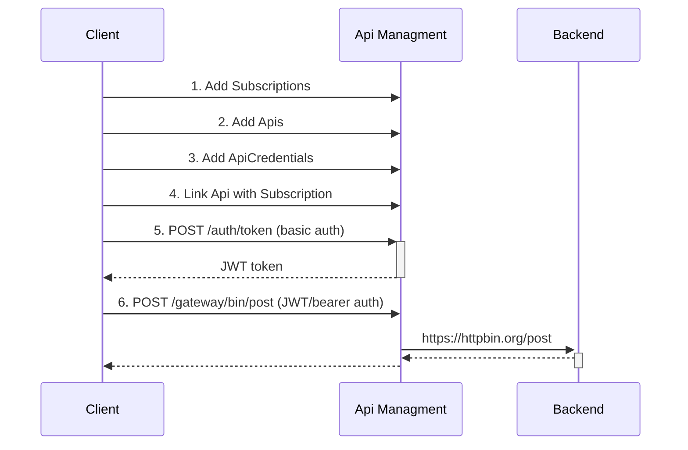

# Background

This project contains an api-management system built with Quarkus and Apache Camel and has the following
functionalities:

- support for proxying REST, GraphQl and other http based protocols,
- support for managing Apis & Subscriptions,
- support for Basic Auth, Client Credentials and token based authentication

## Terminology

- _Subscription_: this is similar to a team or an organisation who wants to subscribe and gain access to the
  api-management system.  
  After subscribing successfully, a subscription key will be generated. And this is needed to gain access to the apis.
- _Api_: this is typically an Api that needs to be accessed via the api-management system.
- _Api Credentials_: optional: you can add an authentication method to the Api, if this is needed. The supported methods
  are:
  - basic auth
  - client credentials
  - token based
  - passthrough, this will passthrough anything from the original request to the Api
  - none, this will strip out any authentication to the Api

### Example flow

# Startup Application

Start the app in development mode:
> mvn quarkus:dev

Create a subscription first:
> http -a bob:bob post :8080/subscriptions subject="My Organisation"  
> Connection: close  
> Content-Length: 0  
> Location: http://localhost:8080/subscriptions/N89GERY08JL91R022M5KOBF924XYRPKW

Add an Api:
> http -a bob:bob post :8080/apis proxyPath=/bin proxyUrl=https://httpbin.org owner="Team One" authenticationType=BASIC
> description="httpbin"

Protect the Api with Basic Auth and link it to the subcription:
> http -a bob:bob post :8080/apis/1/credentials subscriptionKey=N89GERY08JL91R022M5KOBF924XYRPKW username=admin
> password=12345

Link Api (with id=1) to the subscription:
> echo "[1]" | http -a bob:bob post :8080/subscriptions/N89GERY08JL91R022M5KOBF924XYRPKW/apis

Then obtain a JWT token for accessing the gateway:
> http -a bob:bob post :8080/auth/token  
> { "access_token": "ej....." }

Save the access token as a variable:
> JWT_TOKEN=ej...

Now call httpbin via the gateway. This will forward your requests to httpbin with Basic Auth:
> http -A bearer -a $JWT_TOKEN post :8080/gateway/bin/post subscription-key:N89GERY08JL91R022M5KOBF924XYRPKW
